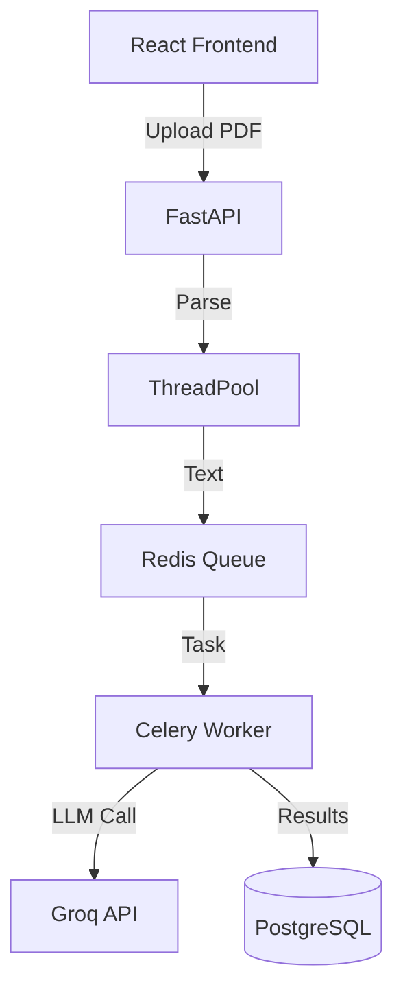

# 🚀 Profile Improvement Roadmap

**Objetivo**: Transformar tu perfil de GitHub en una herramienta de atracción de talento para roles senior.

---

## ✅ Completado (Fase 1)

### README Principal Actualizado

- ✅ Propuesta de valor clara y orientada a senior roles
- ✅ Proyectos reales destacados (Nidus, GitSpy, Argos, MatrixCalc, Skema, FinLogic)
- ✅ Arquitectura técnica visible en cada proyecto
- ✅ Enlaces a documentación técnica (Case Studies, Testing Strategies, Security Postures)
- ✅ Sección "What I'm Looking For" para recruiters
- ✅ Expertise técnica organizada por categorías

---

## 📋 Próximos Pasos Recomendados

### Fase 2: Contenido Visual (Alta Prioridad)

#### 1. Screenshots y Demos

**Impacto**: Alto | **Esfuerzo**: Medio

Para cada proyecto principal, agregar:

- Screenshot del dashboard/UI principal
- GIF animado mostrando funcionalidad clave
- Diagrama de arquitectura visual

**Acción**:

```bash
# Crear carpeta de assets
mkdir -p .github/assets

# Agregar screenshots de:
# - Nidus: Dashboard de candidatos + matching
# - GitSpy: Kanban board + metrics
# - Argos: Trading dashboard
# - MatrixCalc: GlassBox mode visualization
```

#### 2. Diagramas de Arquitectura

**Impacto**: Alto | **Esfuerzo**: Bajo

Usar Mermaid o herramientas como Excalidraw para crear:

- Diagramas de flujo de datos
- Arquitectura de sistemas
- Diagramas de secuencia para flujos críticos

**Ejemplo para Nidus**:



---

### Fase 3: Portfolio Site Enhancement (Media Prioridad)

#### 3. Crear Sección de Case Studies

**Impacto**: Alto | **Esfuerzo**: Alto

En tu portfolio (PortfolioMedalcode), crear páginas dedicadas:

```
src/content/case-studies/
├── en/
│   ├── nidus-ats-architecture.md
│   ├── gitspy-serverless-migration.md
│   └── argos-trading-strategy.md
└── es/
    ├── nidus-ats-arquitectura.md
    ├── gitspy-migracion-serverless.md
    └── argos-estrategia-trading.md
```

**Estructura de cada case study**:

1. **Context**: El problema que resolviste
2. **Challenge**: Restricciones técnicas y de negocio
3. **Solution**: Decisiones arquitectónicas clave
4. **Trade-offs**: Qué sacrificaste y por qué
5. **Results**: Métricas de impacto (performance, escalabilidad)
6. **Lessons Learned**: Qué harías diferente

#### 4. Blog Técnico

**Impacto**: Medio | **Esfuerzo**: Alto

Escribir posts técnicos sobre:

- "Building a Hybrid Sync/Async Architecture with FastAPI and Celery"
- "Serverless Monoliths: Why We Chose Vercel for GitSpy"
- "Testing Strategies for Financial Systems: Lessons from ARGOS"
- "Hexagonal Architecture in Python: A Practical Guide"

---

### Fase 4: Optimización de Descubrimiento (Media Prioridad)

#### 5. SEO y Keywords

**Impacto**: Medio | **Esfuerzo**: Bajo

Optimizar para búsquedas de recruiters:

**En README**:

- Agregar keywords: "Senior Python Engineer", "Full Stack Architect", "AI/ML Engineer"
- Incluir tecnologías específicas en títulos de secciones
- Usar términos de la industria (e.g., "Production-Grade", "Enterprise-Scale")

**En repositorios**:

- Actualizar descripciones con keywords relevantes
- Agregar topics/tags apropiados
- Incluir badges de tecnologías principales

#### 6. GitHub Profile Enhancements

**Impacto**: Medio | **Esfuerzo**: Bajo

Crear archivos especiales:

```bash
# Crear perfil especial de GitHub
mkdir -p ~/Documentos/GitHub/medalcode/.github
```

**Agregar**:

- `FUNDING.yml` si aceptas sponsorships
- `SECURITY.md` con política de seguridad
- Pinned repositories estratégicos (máximo 6)

---

### Fase 5: Métricas y Validación (Baja Prioridad)

#### 7. Analytics y Tracking

**Impacto**: Bajo | **Esfuerzo**: Bajo

Implementar:

- Google Analytics en portfolio
- GitHub traffic monitoring
- LinkedIn profile views tracking

#### 8. A/B Testing de Propuesta de Valor

**Impacto**: Medio | **Esfuerzo**: Bajo

Experimentar con diferentes versiones de:

- Título profesional (e.g., "Senior Full Stack Engineer" vs "Systems Architect")
- Descripción de proyectos (enfoque técnico vs enfoque de negocio)
- Call-to-action (e.g., "Open to opportunities" vs "Available for consulting")

---

## 🎯 Métricas de Éxito

### Corto Plazo (1-2 meses)

- [ ] 5+ screenshots/GIFs agregados a proyectos principales
- [ ] 3+ case studies publicados en portfolio
- [ ] 10+ visitas semanales al portfolio desde GitHub
- [ ] 2+ contactos de recruiters vía LinkedIn

### Mediano Plazo (3-6 meses)

- [ ] 10+ posts técnicos publicados
- [ ] 100+ stars combinados en proyectos principales
- [ ] 5+ entrevistas técnicas para roles senior
- [ ] 1+ oferta de trabajo alineada con objetivos

### Largo Plazo (6-12 meses)

- [ ] Reconocimiento como referente en alguna tecnología específica
- [ ] Invitaciones a conferencias/meetups
- [ ] Contribuciones a proyectos open source de alto perfil
- [ ] Posición senior en empresa target

---

## 💡 Quick Wins (Implementar Esta Semana)

### 1. Actualizar Repositorios Principales

Para cada proyecto destacado (Nidus, GitSpy, Argos):

```bash
# Agregar badges al README
# Ejemplo para Nidus:


```

### 2. Crear GitHub Profile README Mejorado

```bash
cd ~/Documentos/GitHub
# Si no existe, crear repo especial con tu username
# Este README se muestra en tu perfil de GitHub
```

### 3. Pinned Repositories Strategy

Seleccionar los 6 mejores proyectos para "pin":

1. **Nidus** (AI/ML + Full Stack)
2. **GitSpy** (Serverless + DevOps)
3. **Argos** (FinTech + Algorithms)
4. **MatrixCalc** (Data Science + Cloud)
5. **Skema** (Architecture + Design Patterns)
6. **PortfolioMedalcode** (Frontend + UX)

### 4. LinkedIn Sync

Actualizar LinkedIn para que coincida con:

- Título profesional del README
- Proyectos destacados
- Skills técnicas
- Propuesta de valor

---

## 🔧 Herramientas Recomendadas

### Para Diagramas

- **Excalidraw**: Diagramas hand-drawn style
- **Mermaid**: Diagramas en markdown
- **Draw.io**: Diagramas profesionales

### Para Screenshots/GIFs

- **Flameshot**: Screenshots con anotaciones
- **Peek**: GIF recorder para Linux
- **OBS Studio**: Screen recording profesional

### Para Optimización de Imágenes

- **TinyPNG**: Compresión de PNGs
- **ImageOptim**: Optimización batch
- **SVGO**: Optimización de SVGs

### Para Analytics

- **Google Analytics**: Tracking de portfolio
- **Plausible**: Analytics privacy-friendly
- **GitHub Insights**: Métricas nativas

---

## 📚 Recursos de Referencia

### Perfiles de GitHub Inspiradores

- [Sindre Sorhus](https://github.com/sindresorhus)
- [Kent C. Dodds](https://github.com/kentcdodds)
- [Dan Abramov](https://github.com/gaearon)

### Guías de Technical Writing

- [Google Developer Documentation Style Guide](https://developers.google.com/style)
- [Write the Docs](https://www.writethedocs.org/)
- [Architecture Decision Records](https://adr.github.io/)

### Portfolio Inspiration

- [Brittany Chiang](https://brittanychiang.com/)
- [Jack Jeznach](https://jacekjeznach.com/)
- [Bruno Simon](https://bruno-simon.com/)

---

## 🎬 Próxima Acción Inmediata

**Recomendación**: Comenzar con **Fase 2, Acción 1** (Screenshots y Demos)

**Razón**: Alto impacto visual con esfuerzo moderado. Los recruiters y hiring managers toman decisiones en segundos, y las imágenes comunican competencia técnica instantáneamente.

**Tiempo estimado**: 2-3 horas para los 6 proyectos principales.

---

**Última actualización**: Febrero 2026
**Próxima revisión**: Marzo 2026
