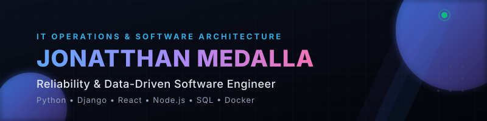

  

 

# Jonatthan Medalla Aliste
### Reliability-focused Software Engineer & Data-driven Developer

---

## 👨‍💻 Sobre Mí

Soy un ingeniero de software con una base sólida de **más de 15 años de trayectoria en operaciones IT de alta disponibilidad y telecomunicaciones**. Mi transición hacia el desarrollo Full Stack y la ingeniería de datos combina lo mejor de dos mundos: la capacidad técnica para escribir código moderno y eficiente, y la mentalidad operativa para garantizar que los sistemas funcionen bajo presión en producción.

*   **Enfoque de Ingeniería:** Construir herramientas estables que automaticen flujos complejos, procesen datos a gran escala y resuelvan problemas operativos reales.
*   **ADN de Operaciones:** Monitoreo, diagnóstico de causa raíz y resiliencia de infraestructura (experiencia real liderando soporte técnico en VTR y Konecta).
*   **Educación y Metodologías:** Analista Programador e Ingeniero en Informática (INACAP), con certificaciones en Cloud Architecture, Diseño de Bases de Datos y Desarrollo Ágil.

---

## 🛠️ Stack Técnico

<table width="100%">
  <tr>
    <td width="30%"><strong>Lenguajes</strong></td>
    <td>Python • JavaScript • TypeScript • SQL • R • HTML5 • CSS3</td>
  </tr>
  <tr>
    <td><strong>Backend &amp; APIs</strong></td>
    <td>Django • FastAPI • Node.js/Express • REST APIs</td>
  </tr>
  <tr>
    <td><strong>Frontend</strong></td>
    <td>React • Vue.js 3 • TypeScript • Astro • Next.js • Tailwind CSS</td>
  </tr>
  <tr>
    <td><strong>Bases de Datos &amp; Caché</strong></td>
    <td>PostgreSQL • MongoDB • DuckDB • Redis • SQLite</td>
  </tr>
  <tr>
    <td><strong>Cloud, DevOps &amp; Infra</strong></td>
    <td>Google Cloud Run • Docker • GitHub Actions • Linux • Vercel • Netlify</td>
  </tr>
  <tr>
    <td><strong>Análisis de Datos</strong></td>
    <td>Pandas • NumPy • Scikit-learn • Power BI • Matplotlib</td>
  </tr>
</table>

---

## 🚀 Proyectos Destacados

### 💰 [FinLogic](https://github.com/Medalcode/FinLogic)
> **Plataforma de Ingeniería de Datos Financieros**

Arquitectura modular diseñada bajo el principio *"Lightweight Ingest, Heavy Analysis"*, optimizada para eliminar la fricción entre la ingesta de datos de mercado y el análisis cuantitativo.

*   **Características clave:** Preservación de datos en capas Bronze (Parquet), queries OLAP ultra rápidas en local, y cálculos vectorizados de métricas clave (NPV, IRR, VaR).
*   **Stack:** `Python` · `FastAPI` · `DuckDB` · `Parquet` · `Docker` · `Apache Kafka`

---

### 🤖 [Nidus](https://github.com/Medalcode/Nidus)
> **Sistema Inteligente de Seguimiento de Candidatos (ATS)**

ATS moderno potenciado por Inteligencia Artificial que analiza currículums en formato PDF, los clasifica semánticamente y genera resúmenes accionables.

*   **Características clave:** Parsing avanzado de documentos, motores de ranking basados en embeddings semánticos y procesamiento en tiempo real para reclutadores.
*   **Stack:** `Python` · `FastAPI` · `React` · `PostgreSQL` · `LLMs / OpenAI API`

---

### 📊 [GitSpy](https://github.com/Medalcode/GitSpy) · [Demo](https://git-spy-tau.vercel.app)
> **Middleware API & Cache Layer para GitHub Analytics**

Middleware intermedio diseñado para optimizar, cachear y auditar consultas de rate-limiting hacia la API de GitHub, permitiendo una observabilidad total de eventos y repositorios.

*   **Características clave:** Cola de eventos asíncronos, almacenamiento en caché inteligente con Redis, y rate-limiting configurable por cliente.
*   **Stack:** `TypeScript` · `Node.js` · `Redis` · `Docker` · `Jest`

---

### 🛰️ [NetOpsToolkit](https://github.com/Medalcode/NetOpsToolkit) · [Demo](https://netops-toolkit.netlify.app)
> **Suite de Herramientas de Red 100% Client-Side**

Una colección de herramientas profesionales para administradores de redes y soporte operativo que se ejecutan enteramente en el cliente, priorizando la velocidad y privacidad.

*   **Características clave:** Calculadora avanzada de VLSM, análisis de direccionamiento IP de subredes, lookup de DNS y generador de plantillas de configuración Cisco.
*   **Stack:** `JavaScript (ES6+)` · `HTML5` · `CSS3 (Vanilla)` · `Netlify`

---

### 📂 Otros Proyectos del Portafolio

⚡ Ver catálogo completo de proyectos desarrollados (Click para expandir)

 

| Proyecto | Descripción | Stack | Recursos |
| :--- | :--- | :--- | :--- |
| **Argos** | Bot de trading algorítmico profesional para Binance Spot con Triple Filtro y dashboard integrado. | `Python`, `Docker`, `Linux` | [Código](https://github.com/Medalcode/Argos) |
| **Myna** | Plataforma de minería de datos, clustering, limpieza y visualización descriptiva de datasets. | `Python`, `Django`, `Pandas` | [Código](https://github.com/Medalcode/Myna) · [Demo](https://myna-gamma.vercel.app) |
| **MatrixCalc** | Calculadora de matrices y álgebra lineal en la nube con motor NumPy y visualización paso a paso. | `Django`, `Vue 3`, `GCP` | [Código](https://github.com/Medalcode/Matrixcalc) · [Demo](https://matrixcalc-frontend-541716295092.us-central1.run.app) |
| **Skema** | Pipeline de triaje y clasificación automática de requerimientos utilizando clasificadores inteligentes. | `Python`, `FastAPI` | [Código](https://github.com/Medalcode/Skema) |
| **Pathwise** | Extensión de Chrome y dashboard con IA para la búsqueda activa y seguimiento de ofertas de empleo. | `JavaScript`, `Python`, `Chrome API` | [Código](https://github.com/Medalcode/Pathwise) · [Demo](https://panoptes-nine.vercel.app) |
| **AutoKanban** | Visualizador de archivos de bitácora markdown locales/remotos transformados a tableros Kanban. | `JavaScript`, `HTML/CSS` | [Código](https://github.com/Medalcode/AutoKanban) |
| **Colabb** | Terminal moderna para Linux potenciada con IA escrita en C++ para máximo rendimiento. | `C++`, `CMake`, `Linux` | [Código](https://github.com/Medalcode/Colabb) |
| **Kitsune** | Plantilla REST API lista para producción con autenticación JWT y base de datos asíncrona. | `FastAPI`, `Docker`, `PostgreSQL` | [Código](https://github.com/Medalcode/Kitsune) |
| **Toallaalacarta** | E-commerce real desarrollado con Astro y headless Shopify, optimizado para conversión. | `Astro`, `TypeScript`, `Tailwind` | [Código](https://github.com/Medalcode/Toallaalacarta) · [Demo](https://toallaalacarta.netlify.app) |

---

## 💼 Experiencia Profesional Relevante

| Empresa / Proyecto | Rol | Período | Logros Clave |
| :--- | :--- | :--- | :--- |
| **Toallaalacarta** | Co-Fundador & Gestor de Operaciones Digitales | 2023 - 2025 | Implementación del e-commerce, integración de APIs de pago y optimización del funnel publicitario. |
| **VTR Comunicaciones** | Ejecutivo Senior Soporte Back Office | 2009 - 2023 | Monitoreo y continuidad de servicios críticos, automatización de KPIs de red y procesamiento de bases de datos operativas. |
| **Konecta Chile** | Ejecutivo de Soporte de Sistemas | 2007 - 2009 | Diagnóstico y resolución de incidencias en telecomunicaciones, aprovisionamiento de hardware y soporte de sistemas. |
| **Anovo** | Técnico de Reparación de Equipos Móviles | 2003 - 2006 | Resolución a nivel de hardware y firmware en dispositivos móviles complejos y gestión del flujo de órdenes técnicas. |

---

## 🎓 Formación & Certificaciones

*   **Analista Programador / Ingeniería en Informática** - *INACAP* (2023 - 2025)
*   **Diplomado en Desarrollo Full Stack** - *INACAP*
*   **Diplomado en Arquitectura Cloud** - *INACAP*
*   **Diplomado en Diseño y Gestión de Bases de Datos** - *INACAP*
*   **Diplomado en Diseño Ágil de Sistemas** - *INACAP*
*   **Administración y Soporte de Sistemas** - *DUOC UC*

---

## 📊 Estadísticas de Actividad

  
  &nbsp;&nbsp;&nbsp;&nbsp;
  

  

---

## 📫 Conectemos

*   🌐 **Portafolio:** [medalcode.dev](https://medalcode.vercel.app)
*   💼 **LinkedIn:** [/in/medalcode](https://linkedin.com/in/medalcode)
*   📧 **Correo:** [jonatthan.medalla@gmail.com](mailto:jonatthan.medalla@gmail.com)
*   📍 **Ubicación:** Santiago, Chile

 

  Última actualización: Mayo 2026 | Construido con ❤️ y automatizado con Medalcode-Agent

