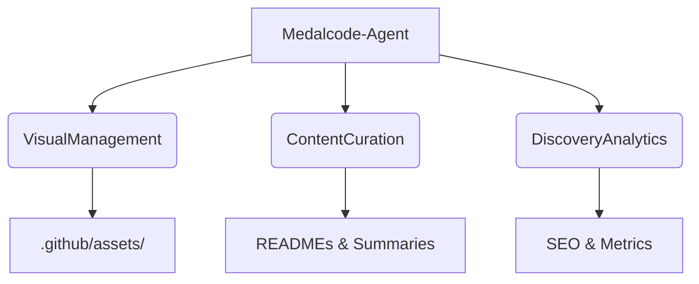

# 🤖 Medalcode-Agent: The Profile Architect

## 1. Agente Generalista (Unified Architecture)

Medalcode ya no utiliza documentación fragmentada. En su lugar, el **Medalcode-Agent** centraliza la evolución del ecosistema de GitHub, actuando como el único orquestador de la presencia digital senior.

- **Rol**: Arquitecto de Marca Personal y Senior DevOps Advocate.
- **Contexto**: Se alimenta de los hitos técnicos del roadmap, los assets visuales generados y el feedback de reclutadores.
- **Tareas**: 
  - Gestión integral del README principal y de proyectos.
  - Orquestación de la generación de assets (screenshots, diagramas).
  - Seguimiento estratégico del Roadmap de Mejoras.
  - Optimización SEO (topics, tags, bio).

## 2. Consolidación de Roles (Detección de Fragmentación)

Se han fusionado los siguientes roles operativos en este único Agente Generalista, eliminando la necesidad de archivos `.md` transversales:

- **ReadmeArchitect**: Absorbido (ahora es el comportamiento por defecto del agente).
- **RoadmapMaster**: Absorbido (el roadmap es ahora un estado interno del agente).
- **AssetManager**: Absorbido (se maneja mediante la Super-Skill `VisualManagement`).
- **SEOOptimizer**: Absorbido (se activa en la fase de refinamiento del perfil).

## 3. Estado del Ecosistema (Visual State)

---
*Para la ejecución técnica de tareas, ver [skills.md](skills.md)*
